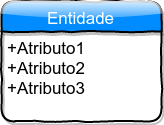

# Convenção para a utilização do diagrama

Oliveira nos apresenta em Projetando banco de dados(*p. 35*) alguns elementos do diagrama que vão servir, preliminarmente, para a contrução de diagramas de entidades com seus relacionamentos - *ER*.

A representação da *entidade* se dá por meio de um *retângulo* e a relação que pode existir entre duas *entidades*, por um losango, conforme a figura abaixo

O relacionamento apresentado na forma de um *losango* é facultativa e deverá desaparecer quando o projeto de um banco de dados chegar até a fase da modelagem física.

Os atributos das entidades serão representados  dentro da entidade que irá, então, ser compreendida como um container, conforme mostra a figura abaixo.

A união de 2 entidades que se relacionam se dá por meio de uma linha. A condição da relação e representada pela linha quando essa for contínua indicando, então, obrigatóriedade (**deve**) ou com um círculo vazia para representar opcionalidade (**pode**), em uma das extremidades da linha.

Quanto ao grau de cardinalidade, um traço na vertical ( **|** ) em uma das extremidades irá indicar uma ocorrência e um tridente, também em uma das pontas, indicará mais de uma ocorrência.

Agora, é importante esclarecer que existem *3* graus de cardinalidade.

- A relação *1* para *1* se dá pela notação **1:1**
- A relação *1* para *muitos* se dá pela notação **1:m**
- A relação *muitos* para *muitos* se dá pela notação **m:n**

A figura abaixo ilustra as possíveis cardinalidades obrigatórias

Essa outra figura ilustra as cardinalidades para demonstrar uma condição *opcional*.

Tomemos esse relacionamento para iustaração, a saber:

**Cada** *CD* **deve ser** *gravado* por **uma única** *Gravadora*.
**Cada** *Gravadora* **deve ter** *gravado* **um ou mais** *CDs*.

Tem-se então:

- **CD** e **Gravadora** como entidades
- **gravado** como relacionamento
- **deve ser** e **deve ter**  como condição obrigatória pois tem a palavra *deve*
- **uma única** e **um ou mais** como grau de cardinalidade *1:m*

Em diagrama:

Melhorando o diagrama versão 1

Melhorando o diagrama versão 2

### Referência externa para estudo.

[UNIP](http://www.noginfo.com.br/arquivos/CC_MDados_07.pdf)

